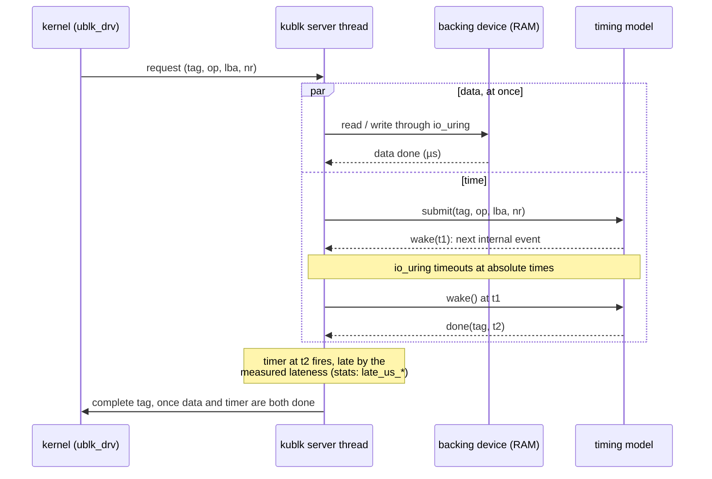

# Architecture

How ublk-disksim turns a RAM disk into a disk with the timing of a real
drive, and where each part lives. For running it see
[GUIDE.md](GUIDE.md); for the evidence that it works see
[VALIDATION.md](VALIDATION.md).

## The idea

A ublk device is a block device whose requests are served by a user-space
process. ublk-disksim serves them with two independent actions per
request:

1. **Data:** the read or write goes to a backing device (normally a
   memory-backed null_blk) at once, through io_uring. Data is never
   delayed, reordered or changed.
2. **Time:** a timing model decides when the request completes, and an
   io_uring timeout at that absolute time (CLOCK_MONOTONIC) completes it.

The request goes back to the kernel when both have finished. Software on
top behaves functionally like on RAM, and sees the latency, throughput,
queueing and flush behaviour of the model.

```
 application / file system
          │  block requests
          ▼
 /dev/ublkbN ── ublk_drv (kernel) ── io_uring ──┐
                                                ▼
                  kublk server thread (one per device, -q 1)
                  ├── model_kublk.c  data I/O to the backing device,
                  │                  completion timers, wake-up timers,
                  │                  stats file, lateness record
                  └── hdd_model.c / ssd_model.c
                        time only: when does each request complete?
```

## Files

| file | role |
|---|---|
| `kublk.c`, `kublk.h`, `common.c`, `file_backed.c`, ... | the kernel's ublk selftest server (linux v6.17), with the targets registered |
| `model.h` | the model interface: `now`, `done`, `wake` |
| `hdd_model.c`, `hdd_model.h` | hard disk model, parameters, profiles |
| `ssd_model.c`, `ssd_model.h` | flash SSD model (SATA or NVMe), parameters, profiles |
| `model_kublk.c`, `model_kublk.h` | glue between a model and the server, shared by both targets |
| `hdd.c`, `ssd.c` | the kublk targets: option parsing, device attributes, calls into the glue and the model |
| `tests/model_test.c` | the models on a virtual clock (`make check`) |
| `bench/` | calibration, integrity check, expected values |

## The model interface

A model never reads a clock and never touches io_uring. Everything it
sees of the world is three calls (`model.h`):

- `now()`: the current time in ns.
- `done(tag, when)`: request `tag` completes at `when`. `when` may be in
  the past; then it completes at once.
- `wake(when)`: call the model again at `when`, when its next internal
  event is due (an actuator becoming free, a flash program finishing).
  The model asks again after every call, so an implementation may keep
  only the earliest wake-up.

A model is called in two ways only: `submit` (a request arrives now) and
`wake` (the time it asked for has come). In the server, `model_kublk.c`
implements the calls with io_uring timeouts: one per request tag for
completions, and up to 64 wake-up slots, re-armed only when an earlier
wake-up is needed. In the tests, `tests/model_test.c` implements them on
a virtual clock.

### A request's life



The model can call `done` from `submit` itself (a cached write, a read
it can schedule at once) or from any later `wake`. Data and time never
wait for each other except at the end: a request completes at the later
of the two, and the data side takes microseconds.

### Own timeline

Both models keep their own time: an operation starts when its resource
became free or when its request arrived, whichever is later, never when
the event loop happens to run. When a wake-up fires late, the model
catches up and computes the same times it would have computed on time;
completions that fall in the past fire at once. (A request's arrival is
the time the server sees it, so a server busy with other work does shift
arrivals.) Host delays show up as **lateness**: actual minus scheduled
completion, taken when the completion timer fires, recorded by the glue
in the stats file (`late_us_p50`, `p99`, `p999`, `max`).

### The floor

Every request pays the host's own overhead: two trips between kernel and
server, and the server thread waking for its timer. The ssd target
subtracts `--floor_us` from each completion, never finishing a request
before it arrived, so that its parameters are device latencies.
`bench/calibrate_ssd.sh` measures the floor on the host it runs on. The
hdd target doesn't need it: its costs are milliseconds.

## hdd model

One actuator, a platter, a volatile write cache.

- **Positioning:** a sqrt seek curve over the distance (none within a
  track, `seek_min_ms` to the next track), then the wait for the sector
  to come round. The sector angle comes from the LBA and the sectors per
  track (media rate / rpm), the platter phase from the clock. A request
  that continues where the head is costs nothing for reads, write-back
  and writes already queued. A write-through write that arrives after
  the previous one finished waits a revolution.
- **Queue:** `pend` holds reads and write-through writes in arrival
  order. The next one served is the one whose transfer can start first
  (shortest positioning time first, which includes rotation) among the
  oldest `ncq`, except that a request passed over for `max_wait_ms` goes
  first.
- **Write cache:** writes complete after the host transfer
  (`iface_us` + bytes / `iface_mbps`) and join the dirty set: extents
  sorted by LBA, merged when they overlap or touch. Write-back picks the
  extent that can start first over the whole set (searching outward from
  the head and stopping once the seek alone can't win) and moves at most
  one track. With `wb_window N` it picks among the N extents that arrived
  first instead (an arrival counter per extent; a merged extent keeps its
  oldest piece's), a drive that reorders little. Its cache space is
  freed when that transfer ends.
- **When write-back runs:** whenever the actuator has nothing queued.
  Once the cache is 3/4 full or writes wait for space, also in turn with
  the queue: one write-back per queued request served.
- **FLUSH:** SATA FLUSH CACHE is non-queued. Queued requests are served,
  the whole dirty set is written back, and everything arriving meanwhile,
  reads included, is held and replayed in arrival order when the flush
  completes. With `cache_mb 0` no volatile cache is advertised, the
  kernel sends no flushes, and writes pay the mechanical cost.

## ssd model

Dies, a host link, a write buffer.

- **Dies:** each has its own timeline. A read of a page (die = page
  number mod `dies`) occupies its die for `tr_us` plus the transfer on
  the flash channel, after whatever the die is already doing, a program
  included. Channels are not a separate resource: their total rate is
  above the host link on the modelled drives.
- **Host link:** a list of busy intervals. Each command takes the
  earliest gap at or after its ready time, for `cmd_us` plus its bytes
  at `iface_mbps`, then `iface_us` of controller latency. Reads use the
  link after their flash read; out of arrival order, which is why it is a
  gap list and not a single free time.
- **Write buffer:** writes complete once their data is buffered. Full
  pages are programmed on whichever die is free first (log-structured).
  A page costs `1 + (waf − 1) × random fraction` program units: writes
  that continue one of the last 8 write streams are sequential, the rest
  random, and steady-state garbage collection is charged to the random
  ones. Units start lazily, when a die is free, so reads interleave with
  programs. A full buffer makes writes wait.
- **FLUSH:** with `plp 1` the buffer is durable and a flush costs
  `flush_us`. With `plp 0` the partly filled page is closed and the flush
  waits until every buffered page is programmed, plus `flush_us`. A flush
  with nothing written since the last one is free. On SATA it is
  non-queued (earlier commands first, later ones held), on NVMe queued.
  `vwc 0` advertises no volatile cache, so the kernel sends none.

## Invariants

These hold at all times. The randomized tests check them after every
model call, over random parameters and workloads:

- every request completes exactly once, and never before it arrived;
- nothing stalls: while requests are in flight, a wake-up or a
  completion is scheduled;
- hdd: the dirty set is sorted, disjoint and non-touching, and
  `dirty_bytes` = its extents + the write-back in progress ≤ the cache;
  when a flush completes, nothing written before it is still in the cache
  or waiting for it;
- ssd: `buf_bytes` = the open page + the unfreed pages ≤ the buffer; a
  SATA flush without PLP completes only once every page before it has
  been programmed;
- a read never waits longer than the age limit plus the operations that
  can precede it (hdd, without flushes).

## Adding a target

1. Write the model against `model.h`: parameters, a `new`/`free`, a
   `submit(tag, op, lba, nr)` and a `wake()`; no clock, no I/O. Keep all
   state in one struct so tests can check it.
2. Add scenario and randomized tests to `tests/model_test.c`.
3. Write the kublk target like `hdd.c`: parse options into the
   parameters, set the device attributes (rotational, volatile cache),
   and forward `queue_io` and `tgt_io_done` through `model_kublk.c`.
4. Register it in `kublk.c`/`kublk.h`, add it to the `Makefile`, and add
   calibration jobs and `bench/expect/<profile>.tsv`.
