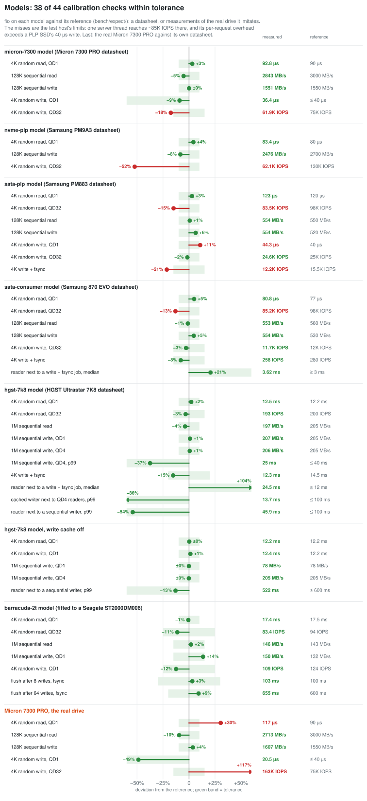
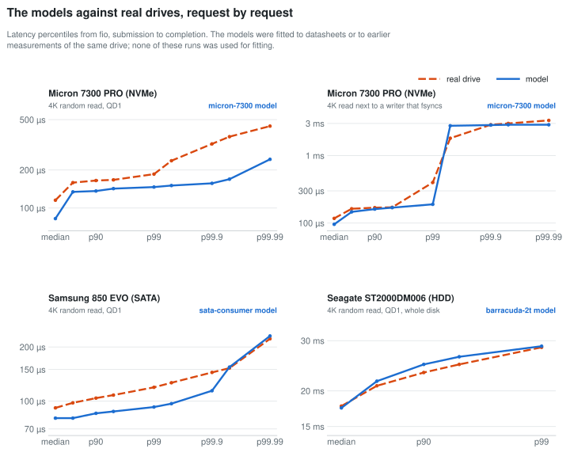

# Validation

What the evidence is that ublk-disksim works, how to rerun each part, and
where the models stop being valid. Five questions, answered separately:

1. Do the models do what [ARCHITECTURE.md](ARCHITECTURE.md) says?
   (model tests)
2. Does the host deliver the models' timing? (lateness)
3. Do the profiles reproduce their drives' published numbers?
   (calibration)
4. Does the emulator ever corrupt data? (integrity)
5. Do the models match real drives they were not fitted to? (real drives)

The numbers below are from a KVM guest (Ubuntu 24.04, kernel 6.17, AMD
EPYC vCPUs, guest halt polling on; see GUIDE §9) unless stated.

## 1. Model tests: `make check`

The models run on a virtual clock (`tests/model_test.c`): a small
discrete-event simulator provides `model.h` instead of io_uring, so every
completion time is exact and repeatable. No root and no ublk needed;
about two minutes.

**Scenario tests** check documented behaviour against values derived
from the parameters and the physics: sums of documented costs, rates
(bytes / media rate; dies × page / program unit, where a unit is
`tprog_us` + page / `ch_mbps`), and bounds. The QD1 random read,
sequential transfer, ordering and bound tests don't depend on how the
model computes; the rate tests restate the documented cost of a program
unit:

| target | behaviour | expected |
|---|---|---|
| hdd | sequential reads | each costs exactly bytes / media rate |
| hdd | random reads, QD1 | mean = `seek_avg_ms` + half a revolution + transfer, ±4% |
| hdd | random reads, QD32 | 180–240 IOPS and > 2.2× QD1 (NCQ reordering) |
| hdd | cached write | `iface_us` + bytes / `iface_mbps` |
| hdd | idle drive | writes its cache back |
| hdd | FLUSH | writes back everything first; a read behind it waits for it; bounded by the worst-case operations |
| hdd | cache off | a random write costs what a read does; FLUSH is free |
| hdd | full cache, sequential writer | a read waits at most two tracks + a full seek + a revolution |
| hdd | full cache, QD4 readers | the cached writer keeps moving (> 30 writes/s, no write over 1 s) |
| hdd | sequential write stream | a random read waits at most `max_wait_ms` + 3 operations; without the limit it starves (control) |
| hdd | 64 scattered cached writes, then FLUSH, `wb_window` 1 | the flush takes 64 × (`seek_avg_ms` + half a revolution + transfer), ±30%; window 0 < 4 < 1 |
| ssd | QD1 read, write | exactly the documented sums (`tr_us` + channel + `cmd_us` + link + `iface_us`) |
| ssd | `floor_us` | subtracted exactly; never below arrival |
| ssd | reads on different dies | overlap; on one die they queue (≥ n × `tr_us`) |
| ssd | SATA QD32 reads | 1 / (`cmd_us` + 4K / link), ±3% |
| ssd | steady random writes | dies × page / (unit × `waf`), ±5% |
| ssd | sequential writes | min(link, dies × page / unit), ±5% (SATA and NVMe) |
| ssd | FLUSH | PLP: `flush_us`; nothing written since the last: free; no PLP: one page program + `flush_us` |
| ssd | SATA vs NVMe FLUSH | SATA holds a read behind it; NVMe doesn't |
| ssd | `vwc 0` | FLUSH does nothing |
| ssd | full buffer | writes wait, and all complete |

**Randomized tests:** 100 hdd and 100 ssd runs with random parameters
(cache size, NCQ window, rpm, age limit, write-back window; SATA/NVMe,
PLP, VWC, dies, page
size, buffer, WAF, floor) and random workloads (reads, writes, flushes,
sizes up to 1 MiB, partly sequential, random gaps between arrivals, at
most a queue depth in flight). The simulator advances the clock to each
arrival before delivering the events due by then, so these runs mostly
exercise the models catching up after late wake-ups. After every model
call they check:

- every request completes exactly once, never before it arrived;
- nothing stalls: requests in flight with no event scheduled fail the
  run;
- hdd: the dirty set is sorted, disjoint and non-touching, and its bytes
  plus the write-back in flight equal `dirty_bytes` ≤ the cache; at a
  flush's completion nothing written before it is left in the cache, and
  the flush completes no earlier than the last write-back ends;
- ssd: buffer bytes = open page + unfreed pages ≤ the buffer; a SATA
  flush without PLP completes only after every earlier page has been
  programmed (all started, none partly filled, the last one ended);
- hdd without flushes: no read waits past the age limit plus the
  operations that can go before it.

The test build also compiles the hdd model with `-DMODEL_CHECK_SPTF`,
which checks every write-back choice against a scan of the whole dirty
set.

**Result:** 36,292,033 checks, 0 failures (the count depends on the
randomized draws, so it changes whenever a parameter is added).

**Can these tests fail?** Planted bugs, one at a time, in a copy of the
tree:

| planted bug | caught by |
|---|---|
| hdd flush acknowledges before its last write-back ends | flush timing check (scenario and randomized) |
| ssd SATA flush without PLP doesn't wait for page programs | flush cost lower bound; flush timing check |
| hdd serves its queue in arrival order (no NCQ reordering) | QD32 ≈ QD1; the starvation control |
| ssd reads ignore die contention | one-die queueing test |
| hdd write-back frees cache space when it starts, not ends | cache capacity scenario: one 64K write too many acknowledged before any write-back could end |

## 2. Lateness: does the host deliver the timing?

A model computes when each request completes; the server arms a timer
for that time. How late the timer actually fires is recorded for every
request and reported in the stats file (`late_us_p50`, `late_us_p99`,
`late_us_p999`, `late_us_max`; quantiles are upper edges of 1/16-octave
buckets). It is the direct measure of how faithfully a given host runs
the model, and `bench/check.py` fails a calibration run if the p99 is
over the target's bound. The table was measured with quarter-octave
buckets, so its quantiles may read up to 19% high.

| run (calibration jobs, 30 s each) | p50 | p99 | max | bound |
|---|---|---|---|---|
| hdd, cache on | 15 µs | 90 µs | 1.2 ms | 500 µs |
| hdd, cache off | 37 µs | 127 µs | 0.97 ms | 500 µs |
| ssd sata-plp | 10 µs | 75 µs | 1.8 ms | 150 µs |
| ssd sata-consumer | 15 µs | 90–107 µs | 1.8 ms | 150 µs |
| ssd nvme-plp | 75 µs | 430 µs | 2.8 ms | 600 µs |

The hdd bound is 4% of a 12 ms operation. The long idle sleeps between
hdd operations pay a slower vCPU wake-up on a KVM guest. `nvme-plp`'s
QD32/QD128 jobs run the one server thread at its limit (~200K IOPS), so
there lateness grows with load; below that it is like the SATA profiles.

This check found a real problem: with a full cache of scattered writes
(~16K dirty extents), choosing the next write-back scanned all of them.
That took longer than a write-back, so the server fell behind: p99
1.2 ms, max 14 ms. The write-back choice now searches a sorted set and
stops early (same choice except exact ties; see the SPTF check above).

## 3. Calibration: `bench/calibrate.sh`, `bench/calibrate_ssd.sh`

Each script runs fixed fio jobs on a fresh RAM-backed device, writes
`results.tsv`, and with a stock profile checks it against
`bench/expect/<profile>.tsv`: expected value, tolerance and the source
of each number (spec sheet, published measurement, or a property of the
model). A run that misses exits non-zero.

On the development host (a KVM guest with guest halt polling, floor
~16 µs) every profile passes:

| profile | checked against | result |
|---|---|---|
| `hgst-7k8`, cache on | spec: seek + latency 12.2 ms, 205 MB/s; typical NCQ ~200 IOPS; production flush 13–16 ms | QD1 read 12.27 ms, QD32 195 IOPS, seq read/write 196/207 MB/s, flush 12.1 ms: all within tolerance |
| `hgst-7k8`, cache off | spec; a revolution per write at QD1 | QD1 read 12.4 ms, write 12.4 ms, seq write QD1/QD4 78/205 MB/s, no device flushes |
| `barracuda-2t`, cache on | one real ST2000DM006 through NTFS: QD1 read 17.5 ms, QD32 94 IOPS, seq 143/132 MB/s, random write 124 IOPS, flush after 8 / 64 writes 127 / 630 ms | QD1 17.3 ms, QD32 82, seq 139/150, random write 108, flush after 8 / 64 103 / 656 ms: all within tolerance |
| `sata-plp` (PM883) | datasheet; published 15.5K synced writes/s | QD1 read 121.6 µs (120), QD32 96.4K (98K), seq 553/553 MB/s (550/520), QD1 write 41.9 µs (40), steady random write 24.6K (25K), synced writes 14.6K/s |
| `nvme-plp` (PM9A3) | datasheet (no VWC) | QD1 read 82.4 µs (80), seq write 2537 MB/s (2700), steady random write 124K (130K), no flushes sent |
| `sata-consumer` (870 EVO) | datasheet; published 248–311 synced writes/s | QD1 read 78.9 µs (77), QD32 96.8K (98K), seq 553/553 MB/s (560/530), steady random write 11.7K (~12K est.), synced writes 260/s |

Not checked, because the host can't deliver it: NVMe reads above
~200K IOPS or ~4 GB/s (one server thread) and NVMe synced writes (the
drive acknowledges faster than the host's per-request floor).

The same scripts on a second, slower host (KVM guest, 16 vCPU AMD EPYC,
linux 6.8, halt polling on, floor ~23 µs), the one with the Micron 7300
PRO below:



38 of the models' 44 checks pass. All six misses are the host: its one
server thread tops out near 85K IOPS (the QD32 rows of four profiles),
and its overhead per write (~27 µs) leaves no room under the PM883's
40 µs write (`sata-plp` QD1 write +11%, write + fsync −21%). The hdd
profiles pass completely. fio 3.28 (Ubuntu 22.04) reports fsync times of
~0.3 µs with libaio; `bench/summary.py` then derives them from the
write + fsync cycle, which reproduces the development host's measured
values (`hgst-7k8` 12.3 ms, flushes after 8 / 64 writes 74 / 334 ms).

### A real drive and its model on the same host

`calibrate_ssd.sh` with `REAL=<device>` runs the same jobs on a real
drive and checks it against the same file, so a profile and the drive
it imitates are held to the same numbers (the model's lateness rows are
skipped; the jobs start 1 MiB into the device). The first pair: a Micron
7300 PRO 3.84 TB passed through to the KVM guest, and `micron-7300`,
fitted to its datasheet, on the same guest. The drive misses its own
datasheet on QD1 reads (117 µs, spec 90) and, being mostly empty, runs
random writes at 163K IOPS instead of the full drive's 75K (last group
of the scorecard).



Where the models hold and where they are too simple:

- **ST2000DM006 / `barracuda-2t`:** median 17.4 vs 17.7 ms, p99 28.7
  vs 28.4 ms. The real drive has a rare tail (p99.9 103 ms) the model
  lacks.
- **850 EVO / `sata-consumer`** (fitted to the newer 870 EVO): the model
  is ~12% fast throughout (median 80 vs 92 µs, p99 93 vs 119 µs).
- **Micron 7300 PRO / `micron-7300`, reads alone:** the drive is slower
  than its datasheet and bimodal (a quarter of the reads take ~170 µs
  instead of ~115 µs; the passthrough's interrupt path is a suspect, not
  verified), the model follows the datasheet (median 94 µs, p99 106 µs).
- **Micron, reads next to a writer that fsyncs:** in the model about a
  fifth of the reads wait for a whole page program (p99 758 µs); the
  real drive delays far fewer (p99 399 µs), consistent with suspending
  a program for a read, which the model doesn't do, but it has a rarer
  multi-millisecond tail (p99.9 2.9 ms).

## 4. Integrity: `bench/integrity.sh`

fio with `--verify=crc32c` on each of hdd (cache on, cache off),
`sata-plp`, `nvme-plp`, `sata-consumer`, and NVMe with a volatile cache
and no PLP. Per device: random writes with fsync then verify,
sequential writes, a 70/30 read/write mix verified while it runs, mixed
block sizes from 512 B to 128 KiB, and a dd round trip compared by
sha256.

**Result:** 42/42 pass, 30 of them data checks (the other 12 are the
write and prefill passes they verify). `NEGATIVE=1` zeroes 8 MiB of the
backing device between the random writes and their verify pass, and the
check fails as it should ("bad magic header"), so it can see corruption;
the control covers that verify path, not the in-run verification of the
mixed jobs.

The models never touch data: it goes to the backing device before the
model sees the request. The backing is RAM, so power loss is not
emulated: nothing is lost at a crash. For crash-consistency tests, stack
`dm-log-writes` on the device and replay.

## 5. Real drives

The profiles are fitted to datasheets and published measurements. As a
check against drives they were not fitted to, the same fio jobs ran
through the file system on a PC's three drives (Windows, NTFS files,
`--direct=1`, fsync = FlushFileBuffers; drives 90–98% full).

**Consumer SATA SSD: Samsung 850 EVO 250 GB vs `sata-consumer`** (fitted
to the 870 EVO, its successor):

| | model | drive | |
|---|---|---|---|
| 4K read QD1 | 78.9 µs | 88.7 µs | −11% |
| 4K read QD32 | 96.6K IOPS | 98.4K IOPS | −2% |
| 128K read / write | 553 / 553 MB/s | 553 / 522 MB/s | 0 / +6% |
| 4K write + fsync QD1 | 260–266/s | 315–320/s | −17% |
| 4K reader next to a fsync writer | 514 IOPS | 615 IOPS | both ~95% below the reader alone |

The non-queued flush blocking reads shows up on the real drive as it
does in the model.

**7200 rpm consumer HDD: Seagate ST2000DM006.** Random read QD32 is only
1.7× QD1, and a flush after N scattered 4K writes costs about
28 + 10 × N ms. That drive barely reorders its queue or its cache, while
`hgst-7k8` assumes the full reordering of an enterprise drive (QD32 ≈
2.4× QD1; a 64-write flush in ~250 ms, not ~650). No enterprise HDD has
been measured yet: `hgst-7k8`'s reordering is an assumption.

**Consumer NVMe: Kingston KC3000 2 TB.** QD1 read and sequential read
match its datasheet (+4%, +6%). Two findings the model doesn't have:
synced writes cost a flat ~380 µs, and a QD1 reader next to a fsync
writer drops by 80%, i.e. a flush slows reads even on NVMe. This was
measured through NTFS, so part of it may be the file system. No shipped
profile models a consumer NVMe drive with a volatile cache.

**What this says about fitting profiles:** read-side numbers from a
datasheet land within ~12%. Write-path numbers need measurement: the
flush cost can't be derived from a datasheet, and sustained write rates
depend on how full the drive is.

## Where the models stop being valid

- **Below the floor:** the ublk round trip plus the server's timer wake
  costs 15–35 µs per request, depending on the host (GUIDE §9). A device
  faster than that comes out at the floor.
- **Above one server thread:** ~200K 4K IOPS and ~4 GB/s.
- **Assumptions:** hdd forced write-back at 3/4 of the cache,
  one-for-one with queued requests; the 500 ms age limit; how much of an
  HDD's buffer caches writes (64 MiB). ssd buffer sizes. None of these
  is published by the drive vendors.
- **Not modelled:** see the "Not modelled" lists in README; in particular
  GC as a process, SLC caching and fill level on SSDs, and zoned
  transfer rates on HDDs.

## Rerunning

```bash
make check                                   # model tests, anywhere
sudo bench/integrity.sh                      # data integrity
sudo bench/calibrate.sh 30                   # hgst-7k8, checked
sudo bench/calibrate.sh 30 --cache_mb 0      # checked against hgst-7k8-wt
sudo bench/calibrate.sh 30 --profile barracuda-2t   # checked against barracuda-2t
sudo bench/calibrate_ssd.sh 30 --profile sata-plp   # likewise per profile
```
